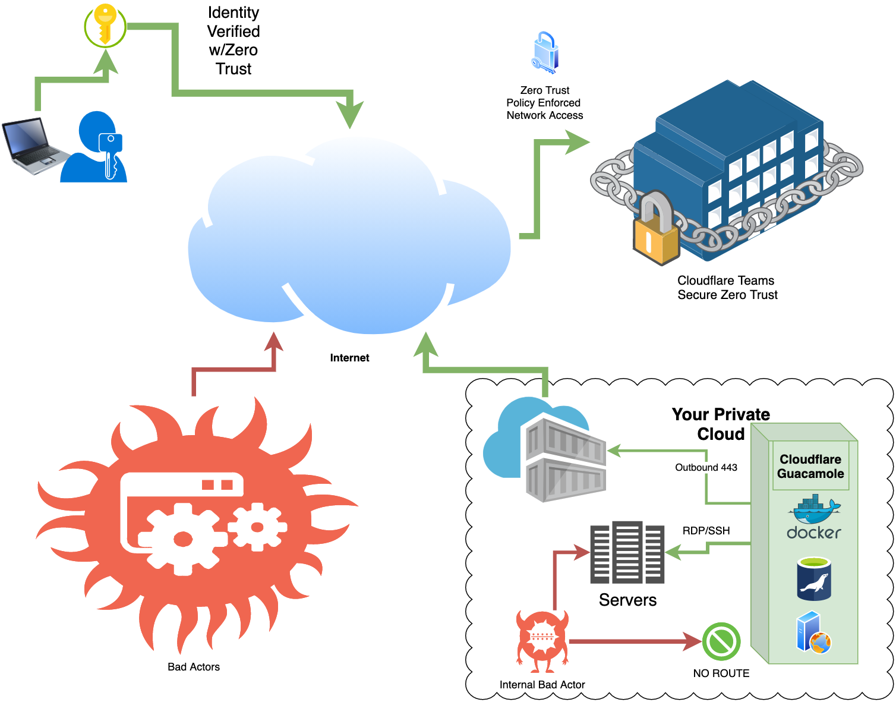

# Zero Trust Cloudflare Guacamole Instant Docker in 日本語

>[!NOTE]
>この文章は私が書いたものであり、作者の方の意図と異なる可能性があります。
>ご了承ください。

## これは Cloudflare Zero Trustのセキュリティ機能及び、Cloudflare Tunnelを利用してGuacamoleをサーバーからネット上に公開することを目的としたリポジトリです。


### Dockerfileで行っていること

1. 最新バージョンのUbuntuをロード

2. Cloudflaredを使用してDNSレコードとルーティングを追加

3. Cloudflaredを使用してWarpネットワークに接続

4. Cloudflaredを使用して既存のCloudflare Teamsに接続

5. 最新バージョンのGuacamoleとGuacdをインストール

6. MariaDBをインストールし、Guacamole用に設定

7. GuacamoleクライアントをTomcatと共にインストールおよび設定




### 準備
リポジトリをGitでクローンし、Dockerfileとconfig.ymlの2つのファイルを設定します。タイムゾーンを設定し、Cloudflare Team名と、Cloudflare Team用のドメインを設定します。

```bash
git clone https://github.com/tetracontinental/cloudflareguacamole
```
**config.yml** - ドメイン名を自分のものに変更します。

```yaml
ingress:
  - hostname: guacamole.yourdomain.com
    service: http://127.0.0.1:8080
  - service: http_status:404
```

**Dockerfile** - タイムゾーンとチーム名を変更します。

```Dockerfile
ENV CLOUDFLARETEAM=yourcloudflareteamname
ENV TZ=Asia/Tokyo
```


### Teams Console Setup
Cloudflareでアプリケーションを設定してください。 ファイルを設定したら、コンテナをビルドします。このプロセス中にCloudflare TeamsコンソールとメインのCloudflareコンソールへのアクセスが必要です。

>[!NOTE]
>アプリケーション名は、guacamoleというホスト名のDNS定義と一致する必要があります。

### ビルドと実行
このコンテナをビルドするには、LinuxまたはMacのDockerホスト上でbuildrun.shを実行します。
手動でDockerコマンドを実行することもできます。ビルド中に一時停止し、Cloudflare Tunnelを認可するためのCloudflare URLが提供されます。このトンネルを承認すると、ビルドが続行されます。

```bash
cd cloudflareguacamole
docker build --no-cache -t cloudflareguacamole .
docker run --name cloudflareguacamole --restart always -d cloudflareguacamole
```

これで、Cloudflareから利用可能なGuacamole環境が準備できました！

>[!WARNING]
>Guacamoleの初期パスワードは、ユーザー名が「guacadmin」、パスワードが「guacadmin」で、URLはyourhostname/guacamoleとなります。
>データベース管理者のパスワードを変更し、guacadminのパスワードも変更してください

コントリビューション
プルリクエストは歓迎します。大きな変更を行う場合は、最初にイシューを開いて変更内容について話し合ってください。

適切にテストを更新するようお願いします。

License
GPLv3